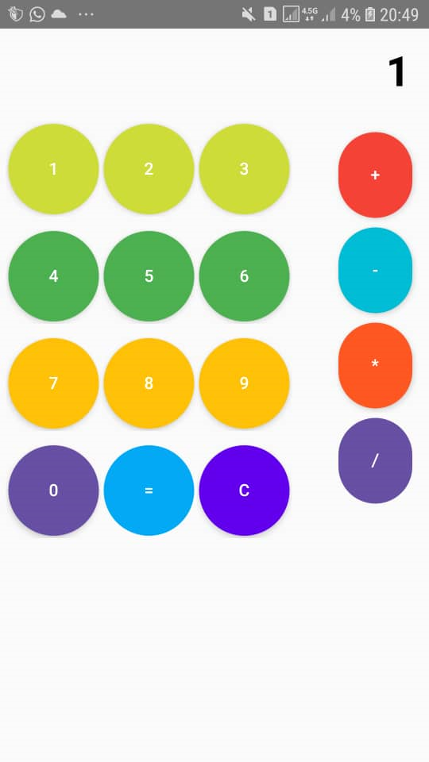

# 🧮 ماشین‌حساب با Jetpack Compose

این پروژه یک ماشین‌حساب ساده و کاربردی است که با استفاده از **Jetpack Compose** در اندروید پیاده‌سازی شده است.
هدف از ساخت این پروژه، تمرین مدیریت State، طراحی UI با Compose و پیاده‌سازی منطق محاسباتی شبیه ماشین‌حساب‌های واقعی بوده است.

---

## ✨ امکانات پروژه

* ➕ ➖ ✖️ ➗ انجام چهار عمل اصلی
* 🔢 نمایش اعداد و عملگرها به‌صورت زنده در صفحه نمایش
* 🧠 امکان ادامه محاسبه روی نتیجه قبلی (Chain Calculation)
* 🔍 نمایش صحیح اعداد صحیح و اعشاری

  * مثال:  `4 ÷ 2 = 2`
  * مثال:  `6 ÷ 12 = 0.5`
* 🎨 رابط کاربری ساده، خوانا و رنگ‌بندی‌شده
* 🧹 دکمه پاک‌کردن (Clear)

---

## 🛠 تکنولوژی‌های استفاده‌شده

* Kotlin
* Jetpack Compose
* Material 3
* State Management با `remember` و `mutableStateOf`

---

## 🧩 نکات فنی قابل توجه

* استفاده از `String` برای نمایش ورودی کاربر (Display)
* جداسازی عدد اول و عملگر برای مدیریت منطق محاسبات
* تبدیل هوشمند نتیجه برای جلوگیری از نمایش `2.0` به‌جای `2`
* پیاده‌سازی منطق دکمه `=` مشابه ماشین‌حساب‌های واقعی

---

## 📷 پیش‌نمایش برنامه

 

---

## 📌 هدف از پروژه

این پروژه یک **پروژه تمرینی** برای یادگیری و تسلط بیشتر روی:

* Jetpack Compose
* مدیریت State
* طراحی UI در اندروید
* پیاده‌سازی منطق محاسباتی

می‌باشد و برای استفاده آموزشی و نمونه‌کار طراحی شده است.

---

## 👤 توسعه‌دهنده

Alireza Halvaei Fard
